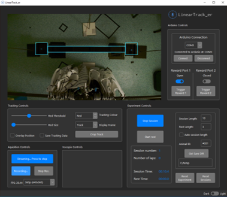
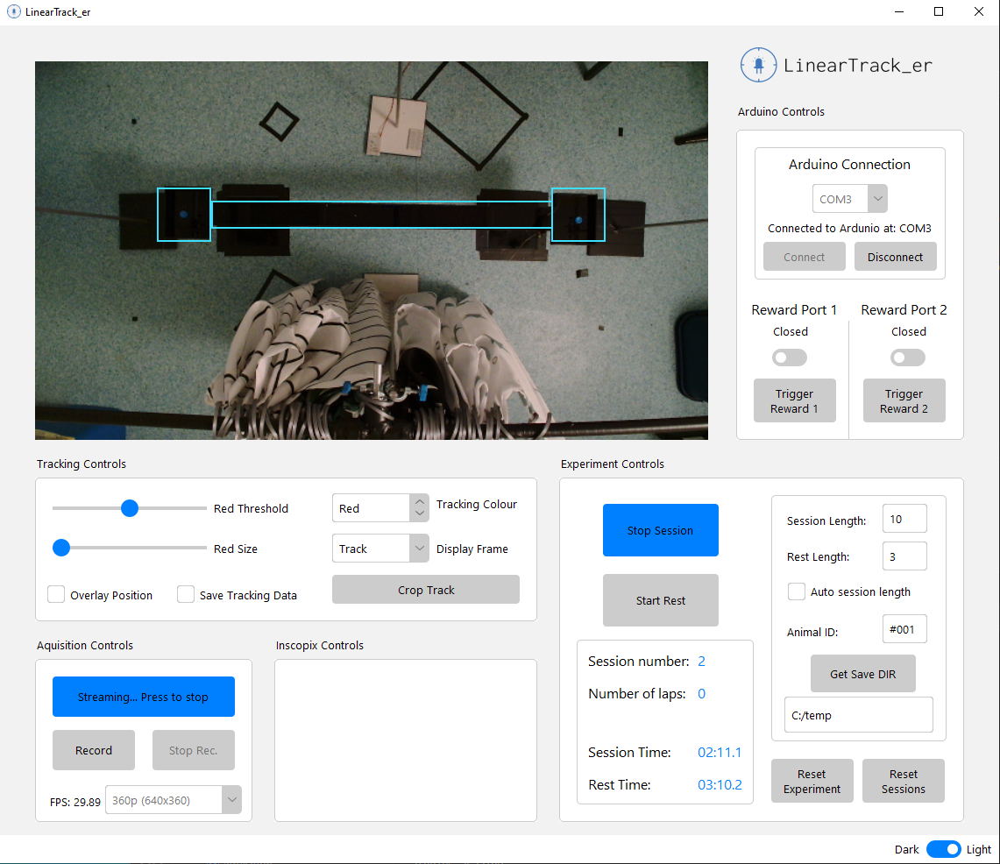

`Desktop app for real-time tracking and experimental control - developed using python, opencv and tkinter`

Custom software that will record and track the position of a rodent via tracking LEDs attached to the rodent.

Custom ROIs added to the video feed can trigger experiment contingencies such as reward delivery and optogenetic stimulation via a serial connection to an Arduino or other microcontroller.

&nbsp;

## Features
- Real-time LED (r,g,b) tracking 
- Stream/record webcam video
- Adjustable parameters sliders for optimised LED detection
- Video overlays for the tracked position/ LED colour mask
- Adjustable ROIs to define tracking zones
- Serial connection to an Arduino to trigger hardware
- Output CSV data, such as video timestamps, tracked coordinates and experiment logic.
- Experiment metrics/controls, such as lap count, session time and automatic session durations.

&nbsp;

## User interface
 

&nbsp;

## Use case 
This app was used for experiment control of linear track experiments where the position of a mouse was tracked via the detection of an LED attached to a head-mounted microscope. 

Upon entering the end zone of the track the app (via serial connection to an Arduino) triggers a solenoid valve to deliver a liquid reward. 
Active reward zones alternate to encourage traversal back and forth on the track.

Additional ROI can be added to add an 'optozone' to the track. When the animal enters the optozone, optogenetic stimulation is triggered (via the Arduino).

Included are some example Arduino sketches that were used in the experiment. 

 
