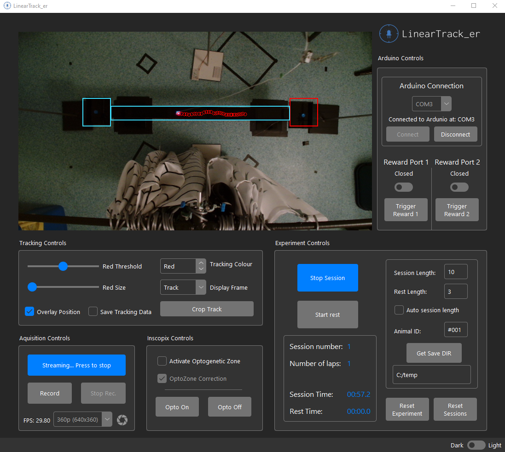
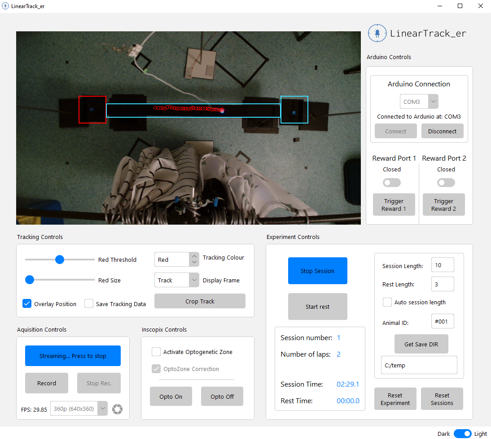

'Desktop app for real time tracking and experimental control - developed using python, opencv and tkinter'

Custom software that will record and track the position of rodent via tracking LEDs attached to the rodent.

Custom ROIs added to the video feed can trigger experiment contingencies such as reward delivery and optogenetic stimulation via a serial conection to an arduino or other microcontroller.

## Features
- Real time LED (r,g,b) tracking 
- Stream/records webcam video
- Serial connection to an arduino
- Output csv data, including frametimes, tracked coordinates etc. 
- Custom experiment contingencies

## User interface
 

## Use case 
This app was used for experiment control of lonear track experiments where the position of mouse was tracked via detection of an LED attached to a head mounted microscope. 

Upon entering the end zone of the track the app (via serial connection to an arduino) triggers a solinoid valve to deliver a liquid reward. 
Active reward zones alternate to encorage traversal back and forth on the track.

Additional ROI can be added to add an 'optozone' to the track. When the animal enters the optozone, optogenetic stimulation is triggered (via the arduino).

Included is some example arduino sketches that were used in the experiment. 

 